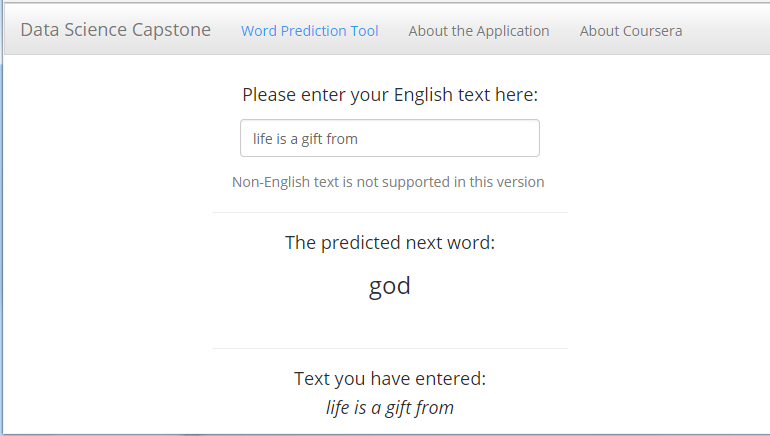

Data Science Capstone Project
========================================================
author: Roman I Ozerov
date: 11/22/2017
font-family: 'Helvetica'
autosize: true

Project Overveiw and Concepts
========================================================
<small>
The goal of Data Science Capstone Project is to produce a predictive text algorithm that suggest the next word likely to be entered based on a previous word (or series of words) that are already entered. The algorithm should use a reasonable amount of resources (disk space, memory and processor power) to work on mobile devices.

The algorithm uses a simple Markov assumption i.e. nth word prediction will be based on previous (n-1) word. It can be either a bi-gram model or tri-gram model.

- Bigram prediction is based on last single word in a given phrase. Bigram model: P(Wi|W1..Wi-1)<-P(Wi|Wi-1)
- Trigram prediction is based on combination of last two words. Trigram model:  P(Wi|W1..Wi-1)<-P(Wi|Wi-2,Wi-1)

We may also use 4-grams ans 5-grams, similar to bigrams and trigrams, but because of the limited system resources it looks like an overkill.   
</small>

Project Source Data
========================================================
<small>
Source data consists of three datasets per European language: real-world blogs, news and and twitter data. Our application supports only English language. Other European languages like French or Russian can be added later, though this algorithm probably can't be used for Eastern languages like Chinese or Japanese.

Three English datasets has been merged together, then cleansed by converting to lowercase, removing digits, punctuation signs, URLs, spaces and prophany words, then sampled by taking N% slice of the dataset. The data sample has been tokenized into n-grams (bigrams, trigrams and quadgrams) which has been transferred to frequency dictionaries.

Bigrams, trigrams and quadgrams, as well as the source data, has been loaded into memory to improve the application performance. We don't use 5-grams because of the resource limitation. Quadgrams gives us an acceptable accuracy.  
</small>

Application Interface
========================================================
<small>
The interface of this application has been designed to use primarely on mobile devices (smartphones, tablets, PDAs, etc).  It looks good on classic computhers too. Can be easily integrated into any application like messenger, chat or web browser.

</small>

Appendixes
========================================================
<small>
Application located at  
<https://rozerov.shinyapps.io/Application/>.

This presentation located at  
<http://rpubs.com/rozerov_RPubs/Capstone>

GitHUB repository, including the application, presentation and some preparation tasks, located at  
<https://github.com/RomanDST/Capstone/>  

Coursera Data Science Specialization and Capstone project:  
<https://www.coursera.org/learn/data-science-project/> 

Have a good Thanksgiving and Merry Christmas :)

</small>

